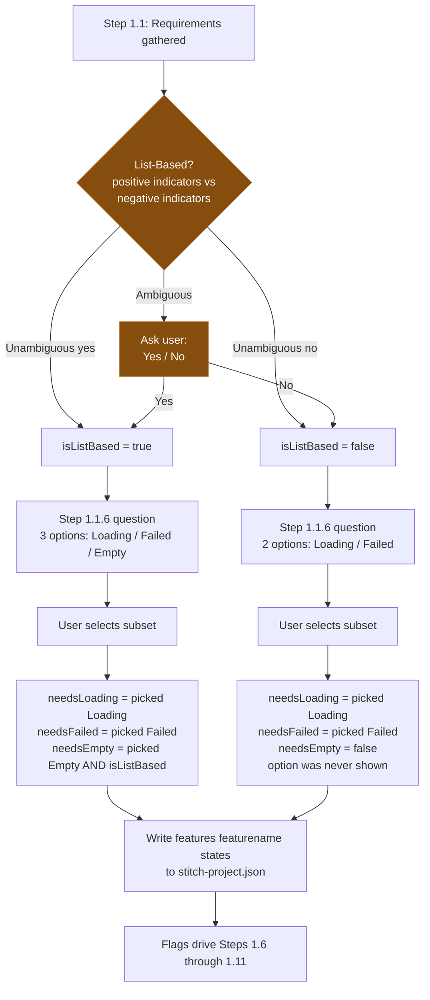
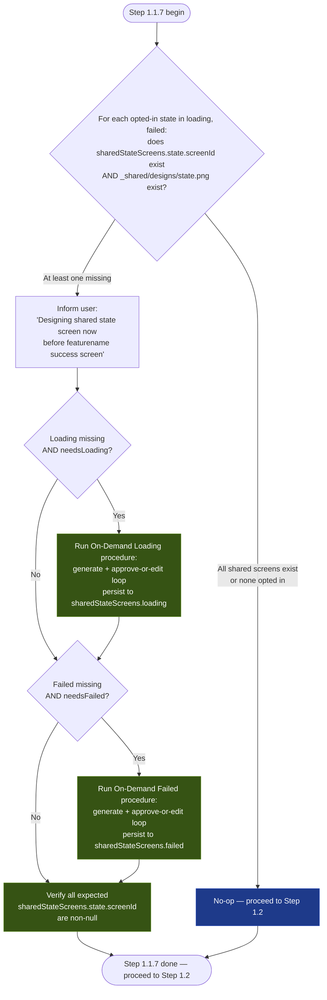
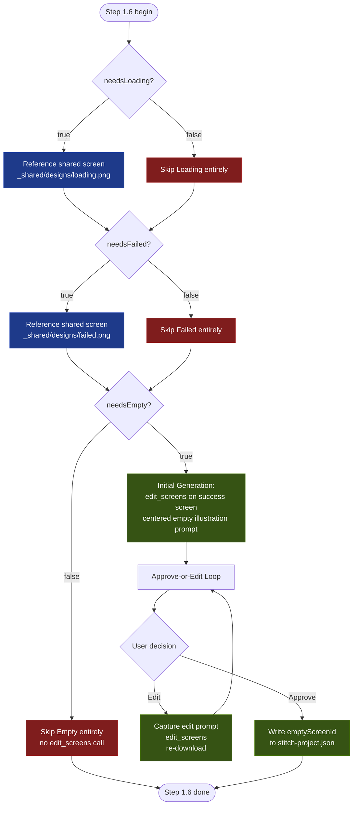
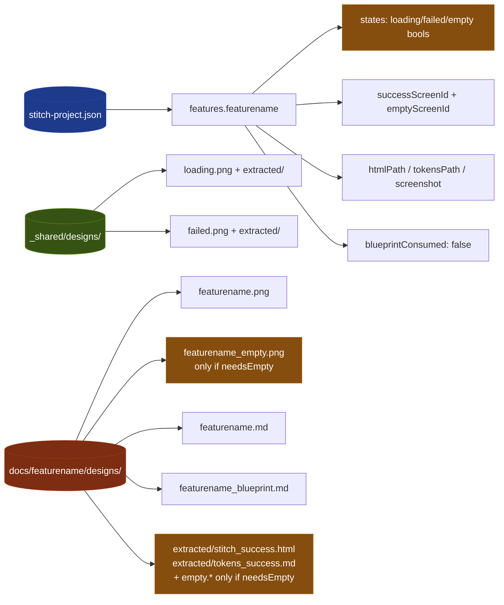
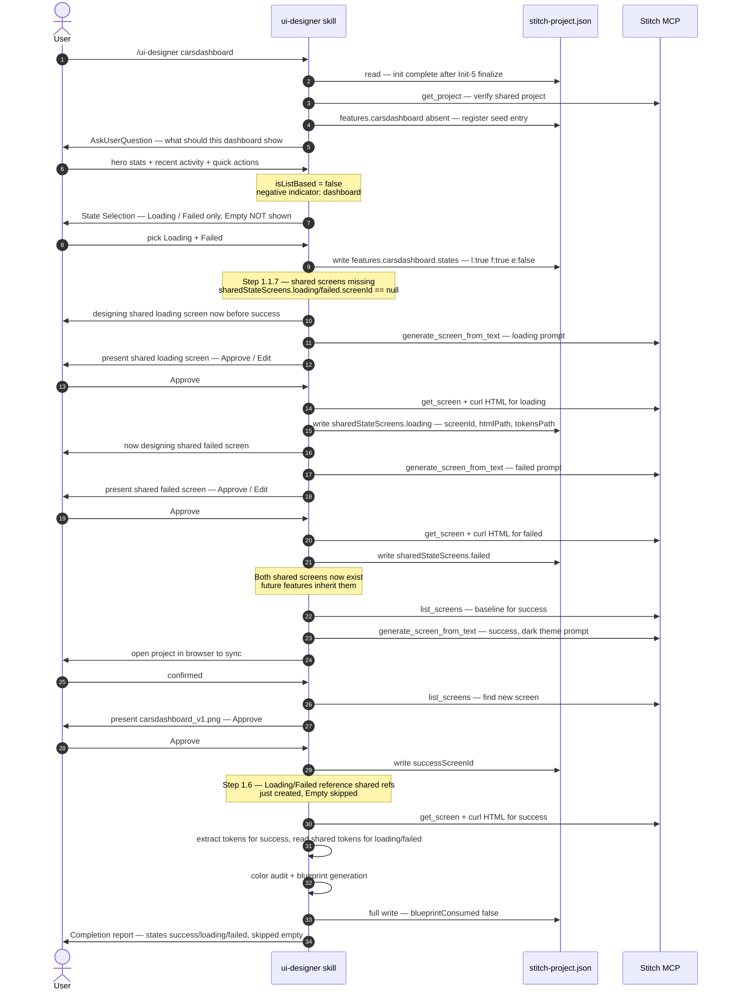

# `/ui-designer` Flow Chart

End-to-end visual reference for what happens when a user invokes `/ui-designer {featurename}`. Mermaid diagrams render in GitHub, VS Code, and most markdown viewers. The textual breakdown below each diagram walks through the same flow step by step.

---

## 1. High-level flow

```mermaid
flowchart TD
    Start([User: /ui-designer featurename]):::user --> InitGate{stitch-project.json exists<br/>AND initState.completedAt set?}
    InitGate -->|No| ProjectInit[[Run Project Init<br/>phases/phase-init.md]]:::sub
    ProjectInit --> InitGate
    InitGate -->|Yes| Phase0Start

    subgraph Phase0[Phase 0 — Per-Feature Preflight]
        direction TB
        Phase0Start([Phase 0 begin]) --> S01[Step 0.1: Load config<br/>+ drift detection]
        S01 --> S02[Step 0.2: Verify Stitch MCP]
        S02 --> S03[Step 0.3: Resolve feature name]
        S03 --> S04[Step 0.4: Register or resume<br/>features featurename entry]
        S04 --> S05[Step 0.5: mkdir docs/featurename/designs]
    end

    S05 --> Phase1Start

    subgraph Phase1[Phase 1 — Design in Stitch]
        direction TB
        Phase1Start([Phase 1 begin]) --> S11[Step 1.1: Gather requirements<br/>+ determine isListBased]
        S11 --> S115{Other approved features exist?}
        S115 -->|Yes| S115Run[Step 1.1.5: Chrome snapshot<br/>+ override confirmation]
        S115 -->|No| S116
        S115Run --> S116
        S116[Step 1.1.6: State Selection<br/>set needsLoading / needsFailed / needsEmpty]:::decision
        S116 --> S117{Any opted-in shared screen<br/>missing in sharedStateScreens?}
        S117 -->|Yes| S117Run[Step 1.1.7: Design missing shared screens<br/>runs phase-init On-Demand Procedures<br/>approve-or-edit loop each]:::gated
        S117 -->|No| S12
        S117Run --> S12[Step 1.2: Generate success screen<br/>in Stitch]
        S12 --> S13[Step 1.3: Present designs]
        S13 --> S14{User picks}
        S14 -->|Edit / Variants / Regenerate| S12
        S14 -->|Approve| S15[Step 1.5: Finalize success]
        S15 --> S16[Step 1.6: State designs<br/>gated on selections]:::gated
        S16 --> S17[Step 1.7: HTML + token inventories<br/>selected states only]:::gated
        S17 --> S18[Step 1.8: Color audit<br/>selected inventories only]:::gated
        S18 --> S19[Step 1.9: Generate blueprint<br/>selected sections only]:::gated
        S19 --> S110[Step 1.10: Update stitch-project.json<br/>blueprintConsumed: false]
        S110 --> S111[Step 1.11: Final approval report]
    end

    S111 --> Done([Complete — user invokes<br/>/creating-kmp-feature or /modifying-kmp-feature]):::done

    classDef user fill:#1e3a8a,stroke:#1e40af,color:#fff
    classDef sub fill:#7c2d12,stroke:#9a3412,color:#fff
    classDef decision fill:#854d0e,stroke:#a16207,color:#fff
    classDef gated fill:#365314,stroke:#4d7c0f,color:#fff
    classDef done fill:#14532d,stroke:#166534,color:#fff
```

---

## 2. State Coverage decision tree (Step 1.1 → 1.1.6)

The dual gate for Empty is the most subtle part of the flow. This diagram makes it explicit.

**Dual-gate truth table for Empty:**

| `isListBased` | User picked "Empty state" | `needsEmpty` |
|---------------|---------------------------|--------------|
| false         | (option not shown)         | **false**    |
| true          | no                         | **false**    |
| true          | yes                        | **true**     |

`needsEmpty` is `true` **only** when both conditions hold. There is no path where a user can force Empty on a non-list screen.

---

## 3. Step 1.1.7 — on-demand shared screen design

The "Run On-Demand procedure" boxes invoke the **On-Demand Procedures** in `phase-init.md` (Generate Shared Loading Screen, Generate Shared Failed Screen) — same generation prompts, same approve-or-edit loops, same persistence targets. There is no separate implementation; Step 1.1.7 is the trigger, the on-demand procedures own the work.

---

## 4. Step 1.6 — per-state branching

The loop tops out at 10 iterations.

---

## 5. What lives where after Phase 1

Loading/Failed shared screens are **never copied** into the per-feature directory — downstream skills read them straight from `_shared/`.

---

## 6. Step-by-step narrative

| Step | What it does | User interaction? | Persists to JSON? |
|------|--------------|-------------------|-------------------|
| 0.1 | Load project config; check XTheme drift | Only if drift detected | Only on drift sync |
| 0.2 | Verify Stitch MCP available | Only on failure (guided setup) | No |
| 0.3 | Resolve feature name | Only if missing/ambiguous | No |
| 0.4 | Register/resume feature entry | No | **Yes** — seeds entry with `states` defaults |
| 0.5 | Create docs dir | No | No |
| 1.1 | Gather requirements + determine `isListBased` | If requirements unclear OR list-based ambiguous | No |
| 1.1.5 | Chrome snapshot from prior features | Only if explicit chrome override detected | No |
| 1.1.6 | State Selection (the new gate) | **Always** — multi-select | **Yes** — writes `features.states` |
| 1.1.7 | Design missing shared loading/failed on demand | Only when opted-in shared screen is absent: approve-or-edit loop per state | **Yes** — writes `sharedStateScreens.{state}` and `_shared/designs/` artifacts |
| 1.2 | Generate success screen in Stitch | Possibly: browser-sync prompt on timeout | No |
| 1.3 | Present designs | **Always** — Approve / Edit / Variants / Regen | No |
| 1.4 | Iterate (loops to 1.3) | Per iteration | No |
| 1.5 | Finalize approved success design | Asks user to clean up Stitch UI | **Yes** — writes `successScreenId`, `successScreenName` |
| 1.6 | State designs gated on selections | Empty: approve-or-edit loop (if `needsEmpty`) | **Yes** — writes `emptyScreenId` when empty approved |
| 1.7 | Acquire HTML + tokens for selected states | No (only browser-sync on timeout) | No |
| 1.8 | Color audit reconciled against inventories | No | No |
| 1.9 | Generate blueprint (selected sections) | No | No |
| 1.10 | Final write of `features.{featurename}` | No | **Yes** — full metadata + `blueprintConsumed: false` |
| 1.11 | Final report shown to user | Read-only | No |

---

## 7. Skip semantics — what "skipped" actually means

| Artifact | If state skipped |
|----------|-----------------|
| Stitch screen | Not referenced; for empty, `emptyScreenId` stays `null` |
| Screenshot file | None on disk (loading/failed: not even a copy of the shared `.png`) |
| Token inventory | Not read in Step 1.7; not consulted in Step 1.8 color audit |
| Blueprint section — loading/failed | Replaced with explicit `**Skipped**` marker pointing implementation at generic handling |
| Blueprint section — empty | **Section omitted entirely** (empty is a content variant, not a Rule-4 UI state) |
| `/verify-ui` audit | State excluded from the audit state list; no audit entry produced |
| Implementation by `/creating-kmp-feature` / `/modifying-kmp-feature` | Feature code must still satisfy Rule 4 (handle all UI states) — generic fallback used; no design reference passed to the UI agent |

---

## 8. Worked example — `/ui-designer carsdashboard`

First feature in a fresh project, non-list dashboard, user picks Loading + Failed. Because init no longer auto-generates shared screens, Step 1.1.7 kicks in and designs both before the success screen.

For a **second** feature (e.g. `/ui-designer transactions`) that also picks Loading + Failed: Step 1.1.7 sees the shared screens already exist (created during carsdashboard) and is a **no-op**. The transactions feature proceeds directly to its own success-screen design.

---

## 9. Cross-references

- Skill entry: [`ui-designer/SKILL.md`](../../../skills/ui-designer/SKILL.md)
- Phase Init (project bootstrap + On-Demand Procedures for shared screens): [`ui-designer/phases/phase-init.md`](../../../skills/ui-designer/phases/phase-init.md)
- Per-feature preflight: [`ui-designer/phases/phase-0-preflight.md`](../../../skills/ui-designer/phases/phase-0-preflight.md)
- Design phase (Steps 1.1 → 1.11, all gating logic): [`ui-designer/phases/phase-1-design.md`](../../../skills/ui-designer/phases/phase-1-design.md)
- Blueprint template + skipped-state markers: [`ui-designer/references/blueprint-spec.md`](../../../skills/ui-designer/references/blueprint-spec.md)
- Stitch MCP usage patterns + known issues: [`ui-designer/references/stitch-guide.md`](../../../skills/ui-designer/references/stitch-guide.md)
- Downstream auditor honoring `states`: [`verify-ui/SKILL.md`](../../../skills/verify-ui/SKILL.md)
