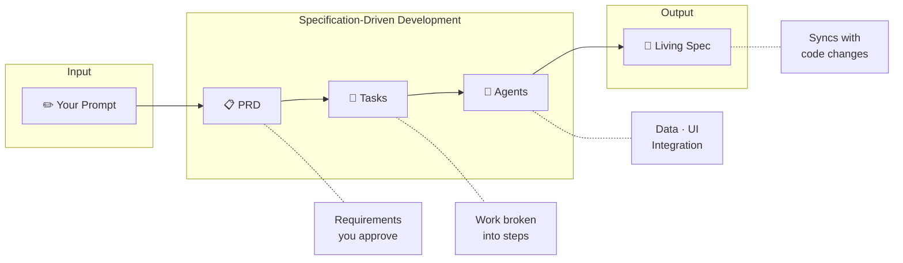

<div align="center">

# KMPilot

**Your specs become your code.**

A Kotlin Multiplatform template where AI agents turn plain English into production-ready features — with architecture that stays clean and documentation that never drifts.

<br />

[](https://kotlinlang.org)
[](https://www.jetbrains.com/compose-multiplatform/)
[](/)
[](/)
[](LICENSE)

<br />

**Built for [Claude Code](https://claude.ai/code)**

<br />

https://github.com/user-attachments/assets/ca64c2cb-e530-4e88-88e2-755932dc5493

<br />

[Documentation](https://github.com/ThisIsSadeghi/KMPilot/wiki) · [Report Bug](https://github.com/ThisIsSadeghi/KMPilot/issues) · [Request Feature](https://github.com/ThisIsSadeghi/KMPilot/issues)

</div>

<br />

## Why KMPilot?

Every KMP project starts the same way. Create a feature module. Write the repository. Wire up the ViewModel. Add navigation. Configure DI. Promise yourself you'll document it later.

KMPilot inverts this. You describe what you want. Specialized agents build it — same patterns, every time. When they're done, you have working code and a living spec that updates when the code changes.

The tradeoff is intentional: **consistency over flexibility.**

<br />

## Quick Start

**Prerequisites:** JDK 21+ · Android Studio · Xcode 15+ (iOS) · [Claude Code](https://docs.anthropic.com/en/docs/claude-code)

```bash
git clone https://github.com/ThisIsSadeghi/KMPilot.git
cd KMPilot
```

Sync Gradle, then:

```bash
claude
> Create a login feature with email and password authentication
```

<br />

## How It Works

KMPilot follows **Specification-Driven Development**. You approve each phase before moving forward.



Every feature follows this flow. The spec becomes the source of truth.

<br />

## What Gets Generated

| Layer | Output |
|:------|:-------|
| **Data** | Models, DataSource (interface + impl), Repository (interface + impl) |
| **Presentation** | UiState, ViewModel, Screen composables, Navigation routes |
| **Integration** | Koin module, app navigation wiring, living spec |

<br />

## Skills & Agents

### Auto-Activated

These trigger based on context — no manual invocation needed:

| Skill | When It Activates |
|:------|:------------------|
| **Feature Creation** | "Create X feature..." → Full SDD workflow |
| **Feature Modification** | "Add X to Y feature..." → Spec-first changes with changelog |
| **Design System** | Any screen/UI work → Enforces X-components over Material3 |
| **Swift-Kotlin Bridge** | iOS SDK integration → Guides interface injection patterns |

### Commands

```bash
/feature-test login     # Generate comprehensive tests for a feature
/feature-review login   # Review feature against architecture rules
/features-health        # Show health status for all features
/audit-spec login       # Audit or regenerate a feature's spec
/coverage               # Generate test coverage report
```

<br />

## Project Structure

```
KMPilot/
├── composeApp/                 # App entry point
│   ├── BaseAppNavHost          # Feature routes registered here
│   └── initKoin                # Feature modules registered here
│
├── core/
│   ├── common/                 # Either, UiState, BaseViewModel
│   ├── data/                   # ApiClient, network config
│   └── designsystem/           # X-components (XButton, XTextField, XScaffold...)
│
├── feature/{name}/             # AI-generated feature modules
│   ├── data/                   # Models, DataSource, Repository
│   ├── presentation/           # ViewModel, Screens, Navigation
│   └── di/                     # Koin module
│
└── .claude/
    ├── agents/                 # Specialized AI agents
    ├── skills/                 # Auto-activated workflows
    └── docs/{feature}/         # Living specifications (spec.md)
```

<br />

## Tech Stack

| Category | Technologies |
|:---------|:-------------|
| **Core** | Kotlin 2.2 · Compose Multiplatform 1.9 · Coroutines & Flow |
| **Network** | Ktor 3.3 · Kotlinx Serialization |
| **Persistence** | Room 2.8 · DataStore |
| **DI** | Koin 4.1 |
| **Navigation** | Navigation Compose 2.9 (type-safe) |
| **Testing** | Turbine · Mokkery · Kover |

<br />

## Documentation

| Resource | Description |
|:---------|:------------|
| **[Wiki](https://github.com/ThisIsSadeghi/KMPilot/wiki)** | Complete reference for agents, skills, and architecture patterns |
| **[CLAUDE.md](CLAUDE.md)** | Rules and conventions that AI agents follow |

<br />

## Contributing

Contributions welcome. See [CONTRIBUTING.md](CONTRIBUTING.md) for guidelines.

<br />

---

<div align="center">

**MIT License**

Created by [@ThisIsSadeghi](https://github.com/ThisIsSadeghi)

Built for developers who'd rather describe features than scaffold them.

</div>
