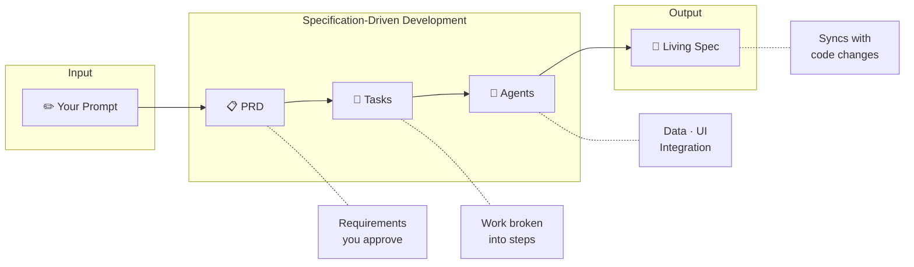
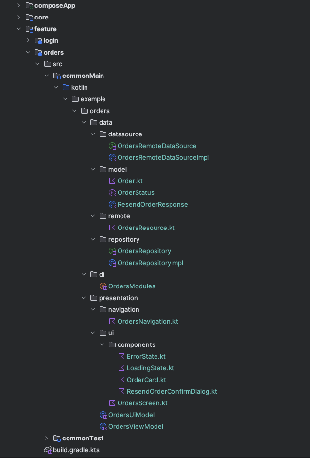

<div align="center">

# KMPilot

**Your specs become your code.**

A Kotlin Multiplatform template where AI agents turn plain English into production-ready features — with architecture that stays clean and documentation that never drifts.

<br />

[](https://kotlinlang.org)
[](https://www.jetbrains.com/compose-multiplatform/)
[](/)
[](/)
[](LICENSE)

<br />

**Built for [Claude Code](https://claude.ai/code)**

<br />

https://github.com/user-attachments/assets/ca64c2cb-e530-4e88-88e2-755932dc5493

<br />

[Documentation](https://github.com/ThisIsSadeghi/KMPilot/wiki) · [Report Bug](https://github.com/ThisIsSadeghi/KMPilot/issues) · [Request Feature](https://github.com/ThisIsSadeghi/KMPilot/issues)

</div>

<br />

## Why KMPilot?

KMPilot encodes an entire production architecture as a composable pipeline of AI skills. You describe a feature in plain English; specialized skills run in sequence — design, scaffold, modify, review, test — producing a working module that follows the same patterns every time.

The architecture happens to be KMP + Clean + Compose Multiplatform. The pattern is bigger than that.

The tradeoff is intentional: **consistency over flexibility.**

<br />

## Quick Start

**Prerequisites:** JDK 21+ · Android Studio · Xcode 15+ (iOS) · [Claude Code](https://docs.anthropic.com/en/docs/claude-code)

One-line install (clones, renames packages, fresh git init):

```bash
curl -fsSL https://raw.githubusercontent.com/ThisIsSadeghi/KMPilot/main/install.sh \
  | sh -s MyProject com.example.myproject
```

Or use GitHub's [**Use this template**](https://github.com/ThisIsSadeghi/KMPilot/generate) button, then rename after cloning:

```bash
./scripts/rename.sh --name=MyProject --pkg=com.example.myproject
```

Then open Claude Code in your new project:

```bash
cd MyProject
claude
> /creating-kmp-feature build a product detail screen with reviews
```

<br />

## How It Works

KMPilot follows **Specification-Driven Development**. You approve each phase before moving forward.



Every feature follows this flow. The spec becomes the source of truth.

<br />

## The Pattern

KMPilot's deeper bet is that **production architectures can be encoded as composable AI-skill pipelines** — not just templates or scaffolds, but workflows where each skill owns one phase (design, scaffold, modify, review, test) and skills compose without coordinating.

For users, this means a single command builds a complete, tested, reviewed feature.

For the ecosystem, this is a pattern other opinionated stacks (Next.js, Rails, Flutter, iOS) can adopt. KMP is the proof point; the pattern is the export.

Read the architecture rules in [CLAUDE.md](CLAUDE.md) and the skill catalog in `.claude/skills/`.

<br />

## What Gets Generated

| Layer | Output |
|:------|:-------|
| **Data** | Models, DataSource (interface + impl), Repository (interface + impl) |
| **Presentation** | UiState, ViewModel, Screen composables, Navigation routes |
| **Integration** | Koin module, app navigation wiring, living spec |

<div align="center">
  
  <p><em>Example: Complete feature module structure</em></p>
</div>

<br />

## Skills & Agents

### Auto-Activated

These trigger based on context — no manual invocation needed:

| Skill | When It Activates |
|:------|:------------------|
| **Feature Creation** | "Create X feature..." → Full SDD workflow |
| **Feature Modification** | "Add X to Y feature..." → Spec-first changes with changelog |
| **Design System** | Any screen/UI work → Enforces X-components over Material3 |
| **Swift-Kotlin Bridge** | iOS SDK integration → Guides interface injection patterns |

### Commands

```bash
/feature-test login     # Generate comprehensive tests for a feature
/feature-review login   # Review feature against architecture rules
/features-health        # Show health status for all features
/audit-spec login       # Audit or regenerate a feature's spec
/coverage               # Generate test coverage report
```

<br />

## Project Structure

```
KMPilot/
├── composeApp/                 # App entry point
│   ├── BaseAppNavHost          # Feature routes registered here
│   └── initKoin                # Feature modules registered here
│
├── core/
│   ├── common/                 # Either, UiState, BaseViewModel
│   ├── data/                   # ApiClient, network config
│   └── designsystem/           # X-components (XButton, XTextField, XScaffold...)
│
├── feature/{name}/             # AI-generated feature modules
│   ├── data/                   # Models, DataSource, Repository
│   ├── presentation/           # ViewModel, Screens, Navigation
│   └── di/                     # Koin module
│
└── .claude/
    ├── agents/                 # Specialized AI agents
    ├── skills/                 # Auto-activated workflows
    └── docs/{feature}/         # Living specifications (spec.md)
```

<br />

## Tech Stack

| Category | Technologies |
|:---------|:-------------|
| **Core** | Kotlin 2.2 · Compose Multiplatform 1.9 · Coroutines & Flow |
| **Network** | Ktor 3.3 · Kotlinx Serialization |
| **Persistence** | Room 2.8 · DataStore |
| **DI** | Koin 4.1 |
| **Navigation** | Navigation Compose 2.9 (type-safe) |
| **Testing** | Turbine · Mokkery · Kover |

<br />

## Documentation

| Resource | Description |
|:---------|:------------|
| **[Wiki](https://github.com/ThisIsSadeghi/KMPilot/wiki)** | Complete reference for agents, skills, and architecture patterns |
| **[CLAUDE.md](CLAUDE.md)** | Rules and conventions that AI agents follow |

<br />

## Contributing

Contributions welcome. See [CONTRIBUTING.md](CONTRIBUTING.md) for guidelines.

<br />

---

<div align="center">

**MIT License**

Created by [@ThisIsSadeghi](https://github.com/ThisIsSadeghi)

Built for developers who'd rather describe features than scaffold them.

</div>
