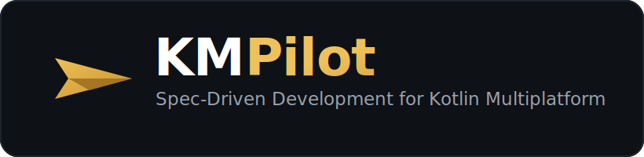
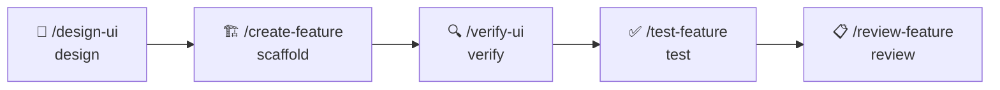

<div align="center">



<br />
<br />

**Describe a feature in plain English — get it designed, built, tested, and reviewed across Android + iOS, with Clean Architecture _enforced, not hoped for_.**

<br />

[](https://github.com/ThisIsSadeghi/KMPilot/releases)
[](https://claude.ai/code)
[](https://kotlinlang.org)
[](https://www.jetbrains.com/compose-multiplatform/)
[](/)
[](/)
[](LICENSE)

<br />

**Watch a feature go from prompt to running app:**

https://github.com/user-attachments/assets/a1438483-68d3-4550-b876-9a62db0d1a21

<sub>Demo: **[Kickoff26](https://github.com/ThisIsSadeghi/Kickoff26)** — a 2026 World Cup companion app, built with KMPilot.</sub>

<br />

[Documentation](https://github.com/ThisIsSadeghi/KMPilot/wiki) · [Report Bug](https://github.com/ThisIsSadeghi/KMPilot/issues) · [Request Feature](https://github.com/ThisIsSadeghi/KMPilot/issues)

</div>

<br />

## ✨ What you get

- 🎨 **Design → code** — describe a screen, get a [Stitch](https://stitch.withgoogle.com) mockup, then a matching Compose UI verified against the design.
- 🏗️ **Features on rails** — every feature lands in the same Clean Architecture shape (data → presentation → DI), shared across Android + iOS.
- 🤖 **Agent-built layers** — specialized agents scaffold the data, UI, and integration code so a whole feature comes from one prompt.
- 📋 **Living specs** — each feature keeps a `spec.md` that stays in sync with the code as it evolves.
- ✅ **Tests & review built in** — fixtures, repository, ViewModel, and UI tests, plus an audit against 14 architecture rules.
- 🍎 **Native when you need it** — guided Swift ↔ Kotlin bridging for iOS SDKs (biometrics, MapKit, payments…).
- 🔄 **Safe updates** — pull new template releases with `./update.sh` without touching your features.

<br />

## ⚡ Quick Start

**Prerequisites:** JDK 21+ · Android Studio · Xcode 15+ (iOS) · [Claude Code](https://docs.anthropic.com/en/docs/claude-code)

**1. Install** — replace `<MyApp>` and `<com.acme.myapp>` with your own values:

```bash
curl -fsSL https://github.com/ThisIsSadeghi/KMPilot/releases/latest/download/install.sh \
  | bash -s <MyApp> <com.acme.myapp>
```

- **`MyApp`** — project name (folder, root project, Android app label)
- **`com.acme.myapp`** — package prefix / application ID (`namespace`, `applicationId`, source-set package roots)

Clones the latest release, renames packages, initializes fresh git — and leaves a `./update.sh` so you can pull future releases later (see [Staying up to date](#-staying-up-to-date)). The installer is **release-pinned**: it clones the exact tag it shipped with, so the installer and the template tree are always the same release.

> **Windows:** run the same command inside **Git Bash** (ships with [Git for Windows](https://git-scm.com/download/win)) or WSL — not PowerShell or `cmd`. The installer uses bash + GNU `sed`/`find`, both present in Git Bash. iOS targets remain macOS-only.

**2. Open in Claude Code**

```bash
cd MyApp && claude
```

**3. Run skills along the lifecycle**

```
> /design-ui checkout flow with delivery options          # design
> /create-feature product detail screen with reviews  # scaffold
> /verify-ui productdetail                                  # verify UI vs design
> /test-feature productdetail                               # test all layers
> /review-feature productdetail                             # audit architecture
```

See [Skills](#-skills) for the full catalog and [The Pattern](#-the-pattern) for the flow.

<br />

## 🔁 The Pattern

**Spec-Driven Development for KMP.** Every feature has a living spec at `.claude/docs/{name}/spec.md` that stays in sync with the code. Skills are phases of one lifecycle:



Each skill owns one phase and composes without coordinating. The blueprint from `/design-ui` is picked up automatically by `/create-feature`; the spec is regenerated as the code evolves; `/verify-ui`, `/test-feature`, and `/review-feature` audit against it.

> The architecture is the constraint, the LLM is the executor, the spec is the contract. KMP is the proof point — the pattern generalizes to any opinionated stack.

<details>
<summary><b>Why not just start from scratch?</b></summary>

<br />

| | From scratch + an LLM | With KMPilot |
|---|:---:|:---:|
| Architecture consistency | drifts feature to feature | one enforced shape, every time |
| Android + iOS | wire it yourself | shared by default |
| UI from a design | hand-translate | Stitch → Compose, verified |
| Tests | if you remember | fixtures + repo + VM + UI generated |
| Code review | manual | audited against 14 rules |
| Spec / docs | rot immediately | living `spec.md`, kept in sync |

</details>

<br />

## 🧩 Skills

Slash-commands ordered by the lifecycle they cover. Run them inside Claude Code in your KMPilot project.

| Phase | Command | Does |
|---|---|---|
| Design | `/design-ui {name}` | Design screens in Google Stitch, produce a Compose blueprint |
| Scaffold | `/create-feature {prompt}` | Build a complete feature from a prompt (uses the blueprint if present) |
| Iterate | `/modify-feature {prompt}` | Apply changes to an existing feature |
| Verify UI | `/verify-ui {name}` | Audit the implementation against the Stitch design |
| Test | `/test-feature {name}` | Generate fixtures, repository, ViewModel, and UI tests |
| Review | `/review-feature {name}` | Audit a feature against the 14 architecture rules |
| Spec | `/audit-spec {name}` | Regenerate or diff a feature's living spec |
| Coverage | `/coverage` | Test coverage report |
| Health | `/health-report` | Status report across all feature modules |

Plus two auto-activated skills: `using-design-system` (enforces X-components on UI work) and `bridge-swift` (guides iOS SDK integration).

<br />

## 📦 What Gets Generated

Every feature module follows the same Clean Architecture shape, plus a living spec at `.claude/docs/{name}/spec.md` and a full test suite (fixtures, repository, ViewModel, UI) when you run `/test-feature`.

<details>
<summary><b>Feature module layout</b></summary>

```
feature/{name}/
├── data/
│   ├── model/                            # @Serializable DTOs
│   ├── remote/                           # Ktor Resources
│   ├── datasource/
│   │   ├── {Name}RemoteDataSource.kt     # interface
│   │   └── {Name}RemoteDataSourceImpl.kt
│   └── repository/
│       ├── {Name}Repository.kt           # interface
│       └── {Name}RepositoryImpl.kt
├── presentation/
│   ├── {Name}ViewModel.kt
│   ├── {Name}UiModel.kt                   # single state container (plain fields + UiState<DTO>)
│   ├── ui/
│   │   ├── {Name}Screen.kt               # Screen + testable ScreenRoot (3-name allowlist)
│   │   ├── {Name}Utils.kt                # optional: formatters, validators
│   │   └── components/                   # one file per @Composable (incl. {Name}Content.kt)
│   └── navigation/
│       └── {Name}Navigation.kt           # Route + NavGraphBuilder extension
└── di/
    └── {Name}Modules.kt                  # Koin bindings
```

</details>

<br />

## 🗂️ Project Structure

<details>
<summary><b>Repository layout</b></summary>

```
KMPilot/
├── composeApp/                 # Shared entry point
│   ├── BaseAppNavHost          # Feature routes registered here
│   └── initKoin                # Feature modules registered here
│
├── core/
│   ├── common/                 # Either, UiState, UiText, ErrorModel
│   ├── data/                   # ApiClient, network config
│   └── designsystem/           # X-components (XButton, XTextField, XScreen...)
│
├── feature/{name}/             # AI-generated feature modules
│   ├── data/                   # Models, DataSource, Repository
│   ├── presentation/           # ViewModel, Screens, Navigation
│   └── di/                     # Koin module
│
└── .claude/
    ├── agents/                 # Specialized AI agents
    ├── commands/               # Slash-command definitions
    ├── skills/                 # Skill workflows
    └── docs/{feature}/         # Living specifications (spec.md)
```

</details>

<br />

## 🛠️ Tech Stack

| Category | Technologies |
|:---------|:-------------|
| **Core** | Kotlin · Compose Multiplatform · Coroutines & Flow |
| **Network** | Ktor · Kotlinx Serialization |
| **Persistence** | DataStore |
| **DI** | Koin |
| **Navigation** | Navigation Compose (type-safe) |
| **Testing** | Turbine · Mokkery · Kover |

<br />

## 🔄 Staying up to date

The installer pins your project to a tagged release and leaves a `./update.sh` so you can pull later releases **without corrupting your code**:

```bash
./update.sh            # tooling only — .claude skills/agents/hooks, CLAUDE.md, gradle wrapper
./update.sh --core     # also merge core/ modules (rename-aware; conflicts are surfaced, never silent)
./update.sh --dry-run  # preview what would change; writes nothing
```

It re-applies your package rename to each upstream change and 3-way-merges it in. It **never touches** `feature/`, your app modules, or your per-feature specs, and it **never commits** — you review `git diff`, resolve any `<<<<<<<` markers, then commit. `update.sh` keeps itself current (it's part of the tooling tier): when the updater changes upstream it writes an `update.sh.new` for you to swap in. See [CHANGELOG.md](CHANGELOG.md) for each release's upgrade notes (tagged `[Tooling]` / `[Core]` / `[Breaking]`).

> **Migrating a project installed from 0.1.0:** existing projects are unaffected in place. To get the self-updating `update.sh`, re-pull it once —
> `curl -fsSL https://raw.githubusercontent.com/ThisIsSadeghi/KMPilot/main/update.sh -o update.sh` — then run `./update.sh` as usual.

<br />

## 📚 Documentation

| Resource | Description |
|:---------|:------------|
| **[Wiki](https://github.com/ThisIsSadeghi/KMPilot/wiki)** | Complete reference for agents, skills, and architecture patterns |
| **[CHANGELOG.md](CHANGELOG.md)** | Release history + downstream upgrade notes |
| **[CLAUDE.md](CLAUDE.md)** | Rules and conventions that AI agents follow |

<br />

## 🤝 Contributing

Contributions welcome. See [CONTRIBUTING.md](CONTRIBUTING.md) for guidelines.

<br />

---

<div align="center">

⭐ **If KMPilot saves you time, consider starring the repo.**

**MIT License**

</div>
